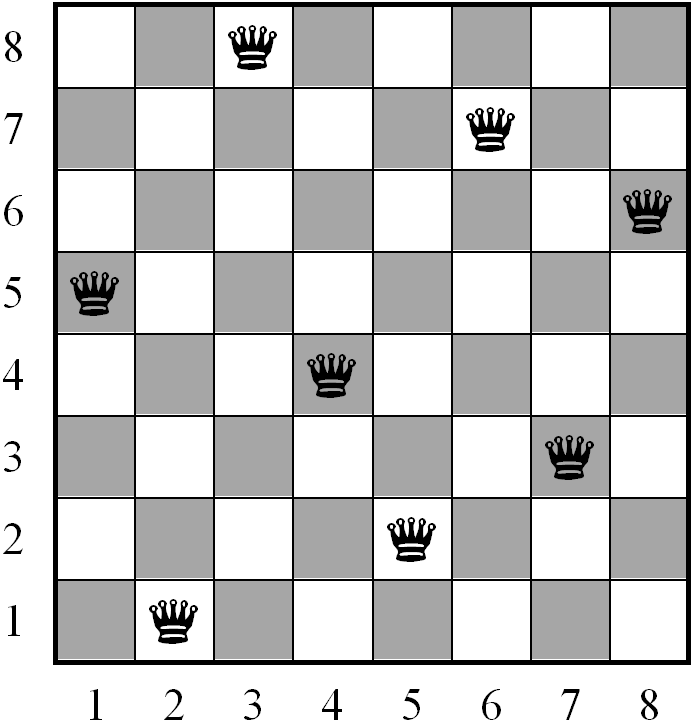

# N-Queens Solver

Našou úlohou je nájsť riešenie problému **ôsmich dám (n dám)**. Treba nájsť také rozloženie dám na 
štvorcovej šachovnici, že sa navzájom nebudú ohrozovať. Počet dám je rovnaký ako rozmer 
šachovnice, teda pre štandardnú 8 x 8 šachovnicu je dám 8. Problém máme riešiť aj pre n x n 
šachovnice, a teda n dám.

Problém riešime dvoma algoritmami:
1. Prehľadávanie v lúči
2. Zakázané prehľadávanie (tabu search)

Následne porovnávame efektivitu oboch algoritmov.

## Implementácia

Program je konzolová aplikácia, ktorá bola vytvorená v programovacom jazyku Python 3. Spúšťa sa 
súbor Main.py a to štandardne:
`$ python Main.py`